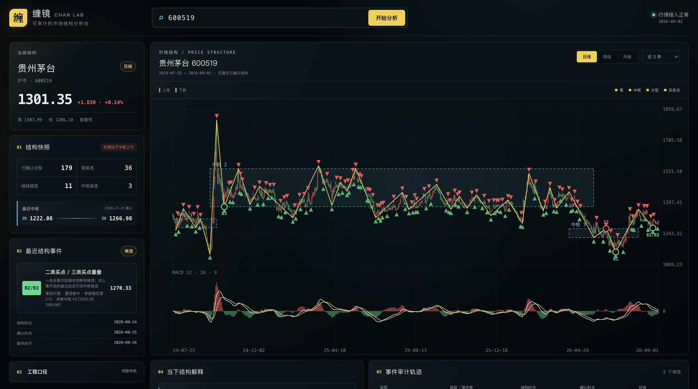
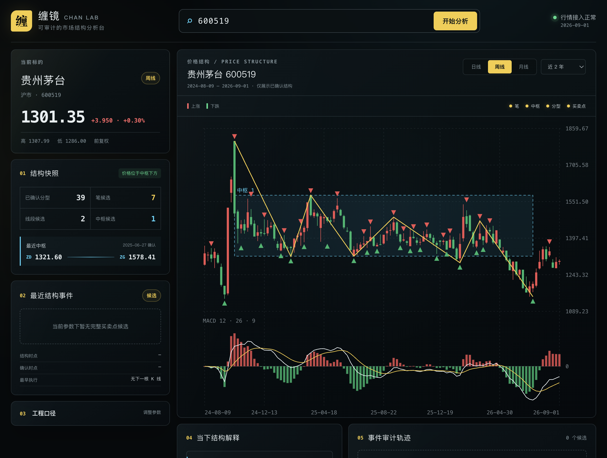
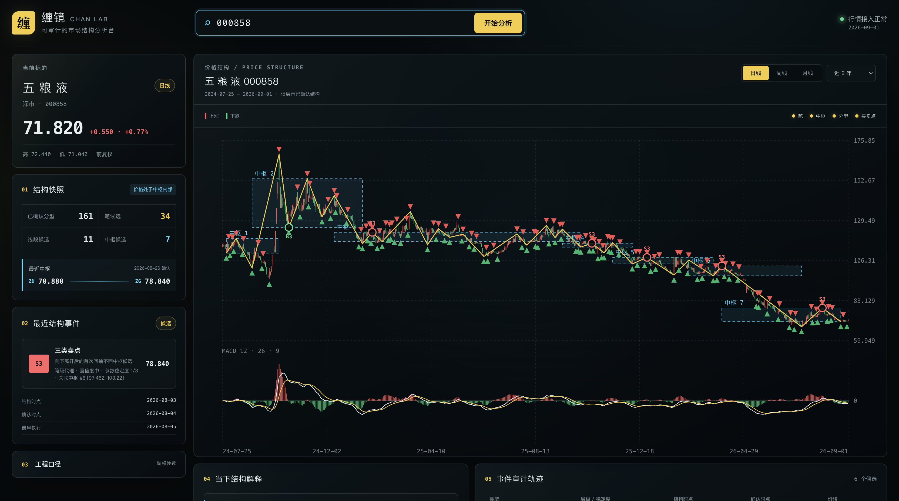

# 缠镜 Chan Lab

> 可审计的沪深 A 股缠论结构分析台

输入沪深 A 股代码，自动获取前复权行情并生成可审计的缠论工程候选结构。所有结构事件同时保留 `structure_at`（结构发生时点）、`confirmed_at`（确认时点）与最早可执行时点，避免未来函数。



## 功能特性

- **K 线包含关系处理**：严格合并包含 K 线，生成已确认的顶/底分型
- **笔与线段**：连接分型形成笔候选，三笔工程线段聚合为线段候选
- **中枢区间**：基于笔或线段构件，固定初始 `ZD/ZG`，延伸结束后推进至下一同级别中枢
- **MACD 面积背驰**：按同级别 A–B–C 趋势段配对计算 MACD 同向面积收缩，识别趋势背驰
- **三类买卖点候选**：生成一类、二类、三类买卖点候选，附带置信度与参数稳定度评分
- **多周期支持**：日 / 周 / 月线，1—5 年区间可选
- **参数敏感性**：3 / 4 / 5 笔间距下的信号稳定度，可调节最小笔间距与背驰面积阈值
- **图层切换**：笔、中枢、分型、买卖点可独立开关
- **审计轨迹**：事件审计表展示结构时点、确认时点、价格与稳定度，全程可追溯

## 项目截图

### 贵州茅台（600519）日线分析

默认加载贵州茅台日线，展示笔、中枢、分型与买卖点候选的完整结构视图，右侧面板含结构快照、最近事件与工程口径参数。


### 贵州茅台（600519）周线分析

切换至周线周期，结构层级自动重组，中枢与买卖点候选随周期变化更新。



### 五粮液（000858）日线分析

输入任意 6 位沪深 A 股代码即可切换标的。下图展示五粮液日线结构，包含多个中枢与事件审计轨迹。



## 技术栈

| 层级 | 技术 |
|------|------|
| 框架 | Next.js（App Router）+ Vite（vinext） |
| 运行时 | Cloudflare Workers |
| 前端 | React 19 + Canvas 2D 绘图 |
| 样式 | Tailwind CSS 4 |
| 数据库 | Cloudflare D1 + Drizzle ORM |
| 行情源 | 腾讯财经前复权接口 |
| 语言 | TypeScript 5 |

## 本地运行

需要 Node.js 22.13 或更高版本：

```bash
npm install
npm run dev
```

打开 `http://localhost:3000`，默认加载贵州茅台（600519）日线分析。

生产构建与测试：

```bash
npm run build
npm test
```

## 项目结构

```
├── app/
│   ├── api/market/route.ts   # 行情接口（Edge Runtime）
│   ├── ChanChart.tsx         # Canvas 缠论图表组件
│   ├── chatgpt-auth.ts       # 鉴权
│   ├── layout.tsx            # 全局布局
│   └── page.tsx              # 主分析台页面
├── lib/
│   └── chanlun.ts            # 缠论核心算法（包含/分型/笔/中枢/背驰/买卖点）
├── db/
│   ├── index.ts              # Drizzle 数据库连接
│   └── schema.ts             # 数据库 Schema
├── worker/
│   └── index.ts              # Cloudflare Worker 入口
├── tests/
│   ├── chanlun-regression.test.ts  # 结构算法回归测试
│   └── rendered-html.test.mjs      # 渲染输出测试
└── screenshots/              # 项目截图
```

## 口径与风险

网页端先固定中枢的初始 `ZD/ZG`，延伸结束后才推进到下一同级别中枢；趋势由至少两个同向且不重叠的中枢构成，一买/一卖比较中枢链首段 A 与末段 C。C 可以同时是完成并离开末中枢的构件，只要其终点离开核心区间、创价格新极值且 MACD 同向面积收缩；三买/三卖只检查离开后的紧邻首次回试。线段未完整实现特征序列缺口规则，单周期结果也不等同于严格递归走势级别，因此所有信号均称为"候选"，不能把阶段最低价直接等同于买点。

第三方行情可能延迟或缺失。本项目用于市场结构研究，不构成投资建议或收益保证。
